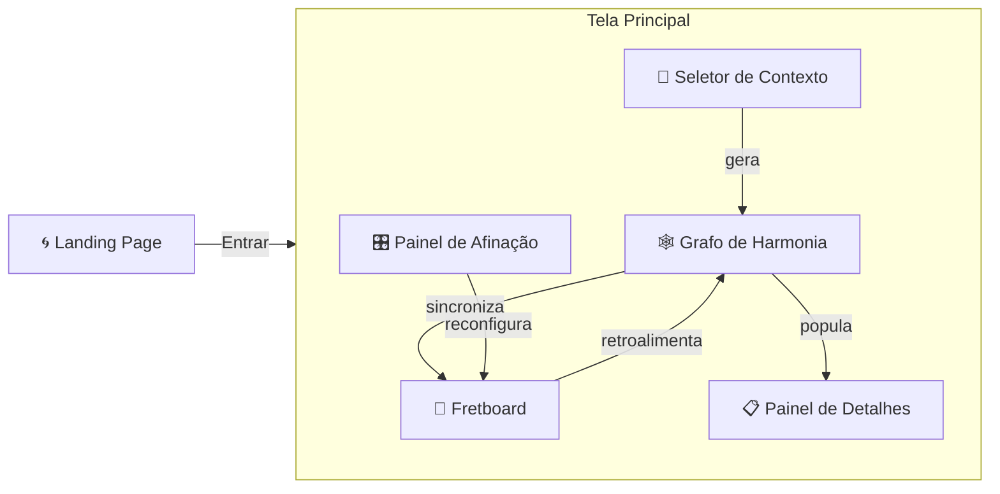
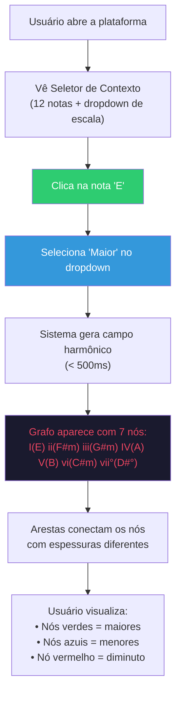
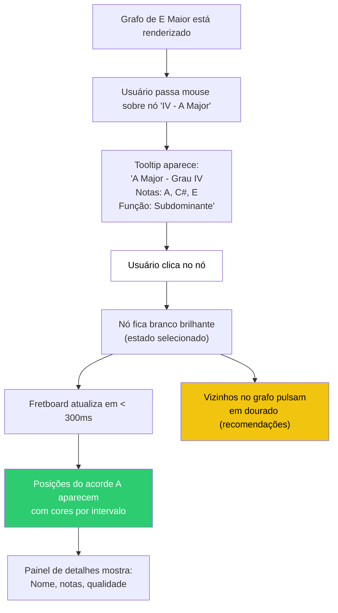
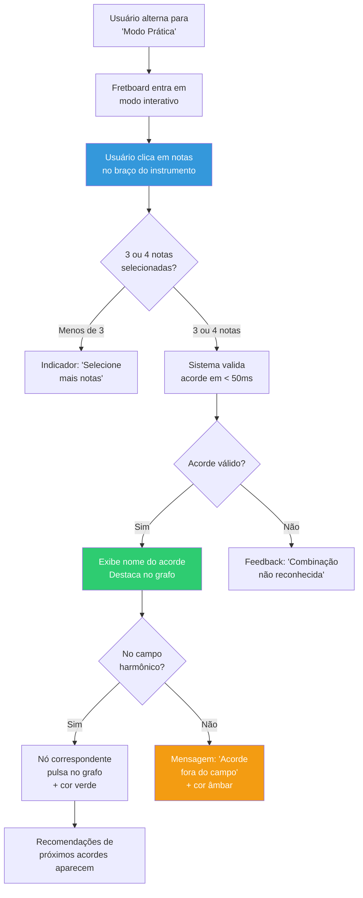
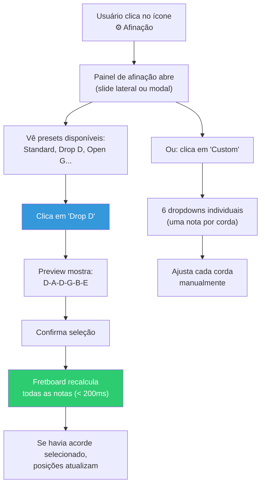
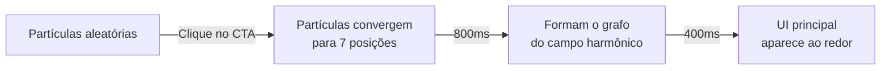

# 🎨 UX & Interação do Usuário — Hearmony

> Derivado dos requisitos RF-01 a RF-06 e RNF-01 a RNF-04

Este documento descreve **o que o usuário vê, toca e sente** ao usar a plataforma Hearmony. Serve como briefing para a criação de arte, wireframes e protótipos de alta fidelidade.

---

## 1. Mapa de Telas (Views)

A plataforma possui **6 views** que o usuário navega. A Landing Page é a tela de entrada; no desktop, as views da aplicação coexistem na mesma tela; no mobile, alternam via tabs.



| View | Função Principal | Requisito |
|------|-----------------|-----------|
| **Landing Page** | Recepção do usuário com animação interativa ao mouse | — |
| **Seletor de Contexto** | Escolher nota raiz + tipo de escala | RF-01 |
| **Grafo de Harmonia** | Visualizar e navegar entre acordes | RF-02, RF-05 |
| **Fretboard** | Ver posições de acordes + montar acordes | RF-03, RF-04 |
| **Painel de Afinação** | Configurar instrumento e afinação | RF-06 |
| **Painel de Detalhes** | Exibir informações do acorde selecionado | RF-03 |

---

## 2. Layouts Responsivos

### Desktop (≥ 1024px) — Visão Integrada

```
┌──────────────────────────────────────────────────────────┐
│  🎵 SELETOR DE CONTEXTO (barra horizontal superior)     │
│  [C] [C#] [D] ... [B]  │  Maior ▼  │  🎛️ Afinação ⚙   │
├────────────────────────┬─────────────────────────────────┤
│                        │                                 │
│   🕸️ GRAFO DE          │   🎸 FRETBOARD                  │
│      HARMONIA          │                                 │
│                        │   ║═══╬═══╬═══╬═══╬═══╬═══║   │
│      ┌───┐    ┌───┐    │   ║   ●   ●       ●       ║   │
│      │ I │────│IV │    │   ║       ●   ●       ●   ║   │
│      └─┬─┘    └───┘    │   ║   ●           ●       ║   │
│        │               │   ║       ●   ●       ●   ║   │
│      ┌─┴─┐    ┌───┐    │   ║═══╬═══╬═══╬═══╬═══╬═══║   │
│      │ V │────│vi │    │                                 │
│      └───┘    └───┘    │                                 │
│                        ├─────────────────────────────────┤
│  📋 DETALHES           │   Recomendações: IV → V → vi    │
│  E Major [E, G#, B]    │   ████████░░ (peso 10)          │
└────────────────────────┴─────────────────────────────────┘
```

### Tablet (768–1023px) — Empilhado

```
┌──────────────────────────────────┐
│  🎵 SELETOR DE CONTEXTO         │
├──────────────────────────────────┤
│         🕸️ GRAFO (reduzido)      │
│     I ── IV ── V ── vi          │
├──────────────────────────────────┤
│         🎸 FRETBOARD             │
│   ║═══╬═══╬═══╬═══╬═══╬═══║    │
├──────────────────────────────────┤
│  📋 Detalhes + Recomendações     │
└──────────────────────────────────┘
```

### Mobile (< 768px) — Tabs

```
┌──────────────────────────┐
│  🎵 SELETOR (compacto)    │
├──────────────────────────┤
│                          │
│   [Conteúdo da tab ativa]│
│                          │
│                          │
├──────────────────────────┤
│  🕸️ Grafo  │ 🎸 Braço    │  ← tabs
└──────────────────────────┘
```

---

## 3. Fluxos de Usuário (User Flows)

### Flow 1 — Explorar Campo Harmônico (RF-01 → RF-02)

> **Caso de uso:** Estudante quer entender quais acordes pertencem à tonalidade de E Maior.



**O que o designer precisa criar:**

| Elemento | Descrição Visual | Interação |
|----------|-----------------|-----------|
| **Grade de notas** | 12 botões (C a B) em linha horizontal ou grade 4×3 | Clique seleciona, estado ativo com borda luminosa |
| **Dropdown de escala** | Select estilizado com 3+ opções | Dropdown abre com animação suave |
| **Animação de transição** | Grafo anterior dissolve, novo aparece | Fade out → fade in com escalonamento dos nós |
| **Estado vazio** | Tela antes de selecionar | Mensagem guia: "Selecione uma nota para começar" |

---

### Flow 2 — Interagir com o Grafo e ver no Braço (RF-02 → RF-03)

> **Caso de uso:** Estudante quer ver como tocar o acorde A Major (IV grau) no violão.



**O que o designer precisa criar:**

| Elemento | Descrição Visual | Interação |
|----------|-----------------|-----------|
| **Nó em hover** | Leve aumento de escala (1.1x) + sombra glow | Cursor muda para pointer |
| **Nó selecionado** | Fundo branco, borda luminosa, texto escuro | Persiste até clicar outro ou limpar |
| **Tooltip do nó** | Card flutuante com nome, grau, notas, função | Aparece em 200ms, desaparece ao sair |
| **Animação de recomendação** | Nós vizinhos pulsam com glow dourado | Pulso suave em loop (1.5s) |
| **Transição do fretboard** | Notas antigas fadeout → novas fadein com bounce | Escalonado por corda (efeito cascata) |
| **Card de detalhes** | Painel lateral/inferior com infos do acorde | Slide-in animado |

---

### Flow 3 — Montar Acorde no Braço (RF-04) — Modo Prática

> **Caso de uso:** Estudante quer praticar montando acordes e ver se acertou.



**O que o designer precisa criar:**

| Elemento | Descrição Visual | Interação |
|----------|-----------------|-----------|
| **Toggle Exploração/Prática** | Switch estilizado com ícones | Animação de transição entre modos |
| **Nota clicável no braço** | Círculo vazio → preenchido ao clicar | Toggle on/off com animação |
| **Indicador de progresso** | Contador "2/3 notas" ou "3/4 notas" | Atualiza em tempo real |
| **Feedback de validação ✅** | Banner verde com nome do acorde | Slide-in por 3s, auto-dismiss |
| **Feedback de erro ❌** | Banner suave (não agressivo) | Tremor sutil na UI, mensagem descritiva |
| **Conexão grafo ↔ braço** | Linha de energia conectando nó ao braço | Animação de partículas ou glow trail |

---

### Flow 4 — Configurar Afinação (RF-06)

> **Caso de uso:** Guitarrista quer mudar para afinação Drop D.



**O que o designer precisa criar:**

| Elemento | Descrição Visual | Interação |
|----------|-----------------|-----------|
| **Ícone de afinação** | Engrenagem ou diapasão estilizado | Abre painel ao clicar |
| **Lista de presets** | Cards com nome + visualização das cordas | Hover mostra preview, clique aplica |
| **Modo customizado** | 6 seletores verticais (um por corda) | Cada um é um dropdown com notas C-B |
| **Slider de capotraste** | Slider horizontal 0-12 | Arrasta com feedback visual instantâneo |
| **Visualização de cordas** | Mini-fretboard simplificado | Mostra as notas atuais das cordas soltas |
| **Seletor de instrumento** | Tabs ou cards: Guitarra / Baixo 4 / Baixo 5 | Altera número de cordas no fretboard |

---

## 4. Inventário de Componentes Visuais

### 4.1 Seletor de Contexto

```
┌─────────────────────────────────────────────────────┐
│  Nota:  [C][C#][D][D#][E][F][F#][G][G#][A][A#][B]  │
│                        ▲ ativo                       │
│  Escala: [ Maior          ▼ ]    🎛️ ⚙️              │
└─────────────────────────────────────────────────────┘
```

| Componente | Arte Necessária |
|------------|----------------|
| Botão de nota (12x) | 3 estados: idle / hover / ativo. Formato circular ou pill. |
| Dropdown de escala | Ícone chevron, lista flutuante com hover states. |
| Botão de afinação | Ícone com badge indicando preset ativo. |

### 4.2 Grafo de Harmonia

```
        ┌────────────┐
        │  ii - F#m  │──────────┐
        │    🔵       │          │ W=9
        └────────────┘          ▼
  ┌────────────┐         ┌────────────┐
  │  IV - A    │◄────────│  V - B     │
  │    🟢       │  W=9    │    🟢       │
  └─────┬──────┘         └─────┬──────┘
        │ W=8                  │ W=10
        ▼                      ▼
  ┌────────────────────────────────────┐
  │           I - E Major              │
  │             🟢 (centro)             │
  └────────────────────────────────────┘
        ▲                      ▲
        │ W=7                  │ W=7
  ┌─────┴──────┐         ┌────┴───────┐
  │  vi - C#m  │         │ vii° - D#° │
  │    🔵       │         │    🔴       │
  └────────────┘         └────────────┘
```

| Componente | Arte Necessária |
|------------|----------------|
| **Nó do Grafo** | Círculo com gradiente por qualidade (verde/azul/vermelho). 4 estados: idle, hover (glow), selected (branco), recommended (dourado pulsante). |
| **Label do Nó** | 2 linhas: grau romano (bold) + nome do acorde (regular). Fonte legível sobre fundo colorido. |
| **Aresta forte** (W≥8) | Linha contínua 3px com seta. Cor suave (cinza ou branco translúcido). |
| **Aresta média** (5-7) | Linha contínua 1.5px sem seta proeminente. |
| **Aresta fraca** (<5) | Linha tracejada 1px, quase invisível. |
| **Animação de recomendação** | Glow pulsante dourado nos nós vizinhos. |
| **Fundo do grafo** | Dark mode com textura sutil ou gradiente radial a partir do nó I. |

### 4.3 Fretboard (Braço do Instrumento)

```
  Corda   0    1    2    3    4    5    6    7
  ─────┬────┬────┬────┬────┬────┬────┬────┬────
  E ───┤    │    │    │ 🔴 │    │    │    │ 🟡
  B ───┤    │ 🟢 │    │    │    │ 🔵 │    │
  G ───┤    │    │    │    │ 🟢 │    │    │
  D ───┤    │    │ 🔴 │    │    │    │ 🟡 │
  A ───┤    │    │    │    │ 🔴 │    │    │
  E ───┤ 🔴 │    │    │ 🟢 │    │    │    │
  ─────┴────┴────┴────┴────┴────┴────┴────┴────
              •              •         •
             3º             5º        7º  ← marcadores
```

| Componente | Arte Necessária |
|------------|----------------|
| **Cordas** | 6 linhas horizontais com espessura crescente (aguda → grave). |
| **Trastes** | Linhas verticais com espaçamento decrescente (simula perspectiva). |
| **Marcadores de posição** | Pontos nos trastes 3, 5, 7, 9, 12 (duplo), 15. |
| **Nota simples** | Círculo preenchido com cor do intervalo, borda branca, label centralizado. |
| **Nota bicolor** | Dois semicírculos (esquerdo = cor primária, direito = cor secundária). |
| **Nota Root** | Destaque especial — borda mais espessa ou halo vermelho. |
| **Tooltip de nota** | Popup minimal: "G# — 3ª Maior". |
| **Nota interativa (modo prática)** | Estado vazio (contorno) → preenchido ao clicar. Animação de "pop". |

### 4.4 Painel de Detalhes do Acorde

```
┌──────────────────────────────┐
│  🟢 E Major                  │
│  Grau: I (Tônica)            │
│                              │
│  Notas: E — G# — B          │
│         R    3     5         │
│                              │
│  Próximos recomendados:      │
│  ████████████░░  B (V)  W=10│
│  ████████░░░░░░  A (IV) W=8 │
│  █████░░░░░░░░░  D#° (vii°) │
│  ████░░░░░░░░░░  C#m (vi)   │
└──────────────────────────────┘
```

| Componente | Arte Necessária |
|------------|----------------|
| **Header do acorde** | Ícone de qualidade (cor) + nome grande. |
| **Notas constituintes** | Cada nota com seu label de intervalo (R, 3, 5, 7). |
| **Barra de recomendação** | Barra horizontal preenchida proporcionalmente ao peso (1-10). Cor do acorde alvo. |
| **Lista de recomendações** | Ordenada por peso, com nome do acorde + grau + tipo de movimento. |

### 4.5 Painel de Afinação

```
┌──────────────────────────────────┐
│  🎛️ Afinação                     │
│                                  │
│  Instrumento: [🎸 Guitarra ▼]    │
│                                  │
│  Presets:                        │
│  [● Standard    ] E-A-D-G-B-E   │
│  [  Drop D      ] D-A-D-G-B-E   │
│  [  Open G      ] D-G-D-G-B-D   │
│  [  Custom...   ]                │
│                                  │
│  Capo: ────●──────── Traste 0    │
│                                  │
│  Cordas:                         │
│  6ª [E▼] 5ª [A▼] 4ª [D▼]        │
│  3ª [G▼] 2ª [B▼] 1ª [E▼]        │
└──────────────────────────────────┘
```

---

## 5. Sistema de Feedback Visual

As cores e animações comunicam **significado funcional**, não apenas estética:

### Feedback por Ação

| Ação do Usuário | Feedback Visual | Feedback Sonoro (futuro) |
|-----------------|----------------|------------------------|
| Seleciona nota raiz | Botão ilumina, grafo anterior dissolve | — |
| Muda escala | Grafo transiciona com morph dos nós | — |
| Clica nó do grafo | Nó fica branco, vizinhos pulsam, fretboard atualiza | Nota toca |
| Hover em nó | Glow sutil + tooltip | — |
| Monta acorde correto | Banner verde + nó pulsa no grafo | Acorde toca |
| Monta acorde inválido | Shake sutil + mensagem descritiva | — |
| Acorde fora do campo | Badge âmbar "fora do campo" | — |
| Limpa seleção (botão direito) | Fade out dos arcos bicolores | — |
| Muda afinação | Fretboard faz "refresh" com animação | — |

### Micro-animações Essenciais

| Animação | Duração | Easing | Contexto |
|----------|---------|--------|----------|
| Nó hover scale | 200ms | ease-out | Hover sobre nó do grafo |
| Nó selection glow | 300ms | ease-in-out | Clique em nó |
| Recomendação pulse | 1500ms | ease-in-out (loop) | Nós sugeridos |
| Fretboard note pop | 150ms | spring | Nota aparece no braço |
| Arco bicolor reveal | 250ms | ease-out | Segunda cor aparece |
| Tooltip fade-in | 200ms | linear | Hover em qualquer elemento |
| Panel slide-in | 300ms | cubic-bezier | Painel de detalhes abre |
| Mode switch | 400ms | ease-in-out | Exploração ↔ Prática |

---

## 6. Paleta Cromática Completa

### Modo Claro / Escuro (Light & Dark Theme)

A plataforma suporta **dois temas visuais** que o usuário pode alternar a qualquer momento. A preferência é persistida entre sessões e respeita `prefers-color-scheme` do sistema como valor inicial.

#### Toggle de Tema

| Elemento | Descrição |
|----------|-----------|
| **Localização** | Canto superior direito, ao lado do ícone de afinação |
| **Ícone** | ☀️ (ativar claro) / 🌙 (ativar escuro) |
| **Animação** | Rotação do ícone (180°) + transição suave de cores (400ms) |
| **Persistência** | Salvo em localStorage, restaurado no próximo acesso |
| **Padrão inicial** | Detecta `prefers-color-scheme` do SO; se indisponível, usa Dark |

#### Tokens — Dark Mode (padrão)

| Token | Hex | Uso |
|-------|-----|-----|
| `bg-primary` | `#0D1117` | Fundo principal |
| `bg-secondary` | `#161B22` | Cards, painéis |
| `bg-elevated` | `#21262D` | Dropdowns, modals |
| `bg-fretboard` | `#1A1A2E` | Fundo do fretboard |
| `border-default` | `#30363D` | Bordas |
| `text-primary` | `#F0F6FC` | Texto principal |
| `text-secondary` | `#8B949E` | Labels, hints |
| `accent` | `#58A6FF` | Links, ações |
| `graph-bg` | `#0D1117` | Fundo do grafo com gradiente radial sutil |
| `node-shadow` | `rgba(0,0,0,0.6)` | Sombra dos nós do grafo |

#### Tokens — Light Mode

| Token | Hex | Uso |
|-------|-----|-----|
| `bg-primary` | `#FFFFFF` | Fundo principal |
| `bg-secondary` | `#F6F8FA` | Cards, painéis |
| `bg-elevated` | `#EAEEF2` | Dropdowns, modals |
| `bg-fretboard` | `#F0EDE5` | Fundo do fretboard (tom amadeirado leve) |
| `border-default` | `#D0D7DE` | Bordas |
| `text-primary` | `#1F2328` | Texto principal |
| `text-secondary` | `#656D76` | Labels, hints |
| `accent` | `#0969DA` | Links, ações |
| `graph-bg` | `#F6F8FA` | Fundo do grafo com gradiente radial sutil |
| `node-shadow` | `rgba(0,0,0,0.12)` | Sombra dos nós do grafo |

#### Regras de Adaptação por Tema

| Componente | Dark Mode | Light Mode |
|------------|-----------|------------|
| **Cores semânticas de acordes** | Mantidas iguais (verde, azul, vermelho) | Mantidas iguais — alto contraste em ambos |
| **Cores de intervalo no fretboard** | Mantidas iguais (12 cores) | Mantidas iguais — vibrantes sobre fundo claro |
| **Nó selecionado** | Branco `#FFFFFF` com glow | Preto `#1F2328` com glow |
| **Arestas do grafo** | Branco translúcido `rgba(255,255,255,0.3)` | Cinza escuro `rgba(31,35,40,0.3)` |
| **Bordas do fretboard** | Cinza claro `#8B949E` | Marrom escuro `#57534E` |
| **Texto nos nós** | Branco sobre fundo colorido | Branco sobre fundo colorido (mantido) |
| **Tooltips** | Fundo `#21262D`, texto branco | Fundo `#1F2328`, texto branco |

### Cores Semânticas de Acordes (da SPEC-3.01)

| Qualidade | Hex | Token |
|-----------|-----|-------|
| Maior | `#2ECC71` | `chord-major` |
| Menor | `#3498DB` | `chord-minor` |
| Diminuto | `#E74C3C` | `chord-diminished` |
| Aumentado | `#F39C12` | `chord-augmented` |
| Selecionado | `#FFFFFF` | `chord-selected` |
| Recomendado | `#F1C40F` | `chord-recommended` |

### Cores de Intervalo no Fretboard (12 cores)

| Intervalo | Hex | Token |
|-----------|-----|-------|
| 0 Root | `#E74C3C` | `note-0` |
| 1 b2 | `#2C3E50` | `note-1` |
| 2 M2 | `#3498DB` | `note-2` |
| 3 m3 | `#27AE60` | `note-3` |
| 4 M3 | `#2ECC71` | `note-4` |
| 5 P4 | `#E67E22` | `note-5` |
| 6 TT | `#9B59B6` | `note-6` |
| 7 P5 | `#F1C40F` | `note-7` |
| 8 m6 | `#E91E63` | `note-8` |
| 9 M6 | `#00BCD4` | `note-9` |
| 10 m7 | `#795548` | `note-10` |
| 11 M7 | `#FF00FF` | `note-11` |

---

## 7. Tipografia

| Uso | Fonte Sugerida | Peso | Tamanho |
|-----|---------------|------|---------|
| Títulos (H1-H2) | **Inter** ou **Outfit** | 700 (Bold) | 24-32px |
| Labels de nó | **Inter** | 600 (SemiBold) | 14-16px |
| Grau romano no nó | **JetBrains Mono** | 700 | 18px |
| Texto de corpo | **Inter** | 400 (Regular) | 14px |
| Labels no fretboard | **Inter** | 700 | 11px |
| Tooltips | **Inter** | 400 | 12px |
| Código/dados | **JetBrains Mono** | 400 | 13px |

---

## 8. Checklist de Arte Necessária

### Assets Gráficos

- [ ] **Ícone do app** — Logotipo Hearmony (variações: dark/light, ícone/full)
- [ ] **Fundo do grafo** — Textura dark com gradiente radial sutil
- [ ] **Ícones de instrumento** — Guitarra, Baixo 4, Baixo 5, Ukulele (outline style)
- [ ] **Ícone de afinação** — Diapasão ou engrenagem musical
- [ ] **Ícone de modo** — Exploração (olho) / Prática (mão)
- [ ] **Marcadores de fretboard** — Dots nos trastes 3, 5, 7, 9, 12, 15
- [ ] **Empty states** — Ilustração "Selecione uma nota para começar"

### Telas para Protótipo (Alta Fidelidade)

- [ ] **Desktop** — Tela principal com grafo + fretboard lado a lado
- [ ] **Desktop** — Acorde selecionado com detalhes e recomendações
- [ ] **Desktop** — Modo prática com notas sendo montadas
- [ ] **Desktop** — Painel de afinação aberto
- [ ] **Tablet** — Layout empilhado
- [ ] **Mobile** — Tab grafo ativa
- [ ] **Mobile** — Tab fretboard ativa
- [ ] **Loading state** — Skeleton/shimmer enquanto gera campo
- [ ] **Onboarding** — Tela de boas-vindas guiando o primeiro uso

---

## 9. Landing Page — Tela de Boas-Vindas Interativa

A Landing Page é a **primeira experiência visual** do usuário com o Hearmony. Deve causar impacto imediato e comunicar a essência do projeto: harmonia musical como uma rede viva de conexões.

### Conceito Visual

A tela exibe um **grafo de partículas generativo** que reage à movimentação do mouse do usuário. As partículas representam notas e formam constelações que evocam campos harmônicos, criando uma metáfora visual entre a interação do usuário e a exploração musical.

### Wireframe

```
┌──────────────────────────────────────────────────────┐
│                                            ☀️/🌙    │
│                                                      │
│            ·  · ·                                    │
│          ·       · ·    ← partículas reagem          │
│        ·    ✦        ·     ao cursor do mouse         │
│          ·       · ·                                  │
│            · · ·                                      │
│                                                      │
│              🎵 Hearmony                              │
│     "Descubra harmonia através de grafos"             │
│                                                      │
│           [ Começar a Explorar → ]                   │
│                                                      │
│     Guitarra  ·  Baixo  ·  Ukulele                   │
│                                                      │
└──────────────────────────────────────────────────────┘
```

### Animação Interativa — Comportamento do Mouse

| Comportamento | Descrição | Parâmetros |
|---------------|-----------|------------|
| **Atração** | Partículas próximas ao cursor são atraídas suavemente em sua direção | Raio: 150px, Força: 0.05 |
| **Repulsão (clique)** | Ao clicar, partículas explodem para fora a partir do cursor | Raio: 200px, Força: 0.3, Decay: 1s |
| **Conexões dinâmicas** | Partículas dentro de uma distância formam linhas translúcidas entre si (simulando arestas de grafo) | Distância máx: 120px, Opacidade: 0.15 |
| **Idle drift** | Sem interação, partículas flutuam suavemente em movimento browniano | Velocidade: 0.3px/frame |
| **Parallax** | Camadas de partículas se movem em velocidades diferentes conforme o mouse se desloca | 3 camadas: 0.5x, 1x, 1.5x |
| **Glow no hover** | Partículas sob o cursor ganham glow colorido (cores semânticas aleatórias: verde, azul, vermelho) | Transition: 200ms |

### Elementos da Landing Page

| Elemento | Descrição Visual | Interação |
|----------|------------------|-----------|
| **Canvas de partículas** | Fullscreen, fundo dark/light conforme tema ativo | Reage ao mouse (atração, parallax) |
| **Logotipo "Hearmony"** | Tipografia grande, centralizada, com leve glow | Fade-in ao carregar (1s delay) |
| **Subtítulo** | "Descubra harmonia através de grafos" — fonte light | Fade-in escalonado (1.5s delay) |
| **CTA "Começar a Explorar"** | Botão pill com gradiente sutil + ícone de seta | Hover: cresce 1.05x + glow. Clique: transição para app |
| **Seletor de instrumento** | 3 ícones (guitarra, baixo, ukulele) com labels discretos | Clique pré-seleciona o instrumento antes de entrar |
| **Toggle de tema** | ☀️/🌙 no canto superior direito | Muda tema da landing + persiste para a app |
| **Partículas → Grafo** | Ao clicar "Começar", as partículas se reorganizam formando um grafo de 7 nós | Animação de transição 800ms: caos → ordem |

### Transição Landing → Aplicação



1. Partículas flutuantes se reorganizam para as 7 posições de nó do grafo
2. Linhas entre partículas engrossam e se tornam arestas ponderadas
3. Labels (I, ii, iii...) aparecem com fade-in
4. Seletor de contexto, fretboard e painéis surgem com slide-in lateral
5. Toda a transição dura ~1.5s

### Especificações Técnicas da Animação

| Propriedade | Valor |
|-------------|-------|
| **Tecnologia** | HTML5 Canvas 2D ou WebGL (para performance) |
| **Partículas** | 80–120 (desktop), 40–60 (mobile) |
| **FPS alvo** | 60fps constante |
| **Fallback mobile** | Partículas respondem ao toque (touch events) em vez do mouse |
| **Acessibilidade** | `prefers-reduced-motion`: desativa animação, mostra versão estática |
| **Performance** | requestAnimationFrame com throttle; pausa quando tab não está visível |

### Arte Necessária para a Landing Page

- [ ] **Logotipo Hearmony** — Versões dark e light, com e sem tagline
- [ ] **Ícones de instrumento** — Guitarra, Baixo, Ukulele (outline, 24px e 48px)
- [ ] **Botão CTA** — Design pill com gradiente (idle, hover, pressed)
- [ ] **Favicon** — Versão minimalista do logo para aba do navegador
- [ ] **OG Image** — Preview para redes sociais (1200×630px)

---

## 10. Resumo: Requisito → Experiência do Usuário

| Requisito | O que o Usuário Vê | O que o Usuário Faz | O que o Usuário Sente |
|-----------|--------------------|--------------------|----------------------|
| **Landing** | Grafo de partículas vivo e reativo | Move o mouse, vê partículas dançarem | Fascínio e curiosidade |
| **RF-01** | 12 notas + dropdown de escala | Clica na nota, seleciona escala | Controle imediato da tonalidade |
| **RF-02** | Grafo com 7 nós coloridos e arestas | Observa relações entre acordes | Compreensão visual da harmonia |
| **RF-03** | Nó selecionado + fretboard atualizado | Clica no nó e vê posições no braço | Conexão direta teoria → prática |
| **RF-04** | Notas clicáveis no braço + validação | Monta acordes nota a nota | Sensação de descoberta e validação |
| **RF-05** | Nós vizinhos pulsando em dourado | Segue as sugestões de progressão | Guiado pelo fluxo harmônico |
| **RF-06** | Painel com presets e sliders | Configura a afinação do instrumento | Personalização e flexibilidade |
