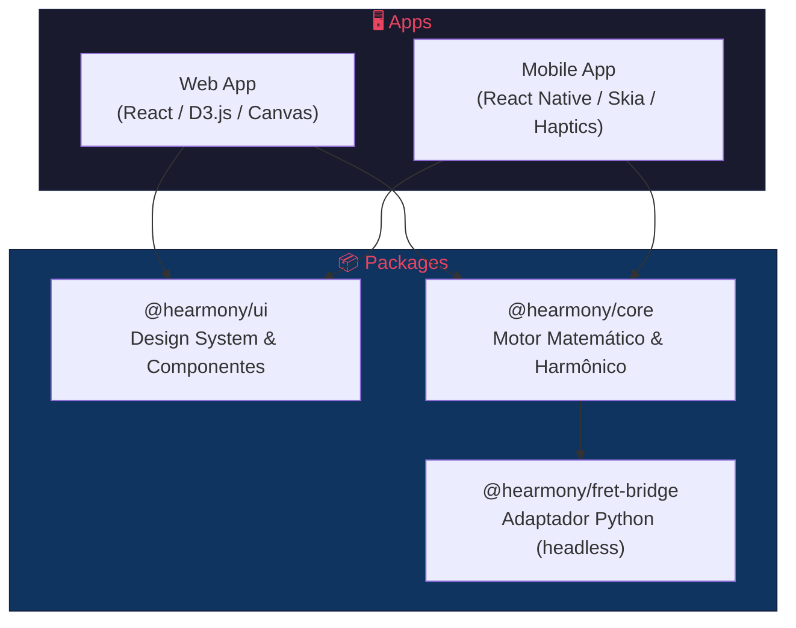

# 🏗️ Arquitetura Técnica — Hearmony

> **Status:** 📝 DRAFT
> **Última atualização:** 2026-06-26

---

## 1. Visão Geral

A plataforma Hearmony utiliza um modelo de dados orientado a **matrizes de adjacência** para calcular o peso e a probabilidade de movimentos harmônicos (progressões de acordes). O motor visual do braço do instrumento escuta estas estruturas matemáticas e as traduz em formas geométricas interativas.

## 2. Diagrama de Camadas



## 3. Princípios Arquiteturais

### 3.1 Isolamento Lógico
Regras de teoria musical **não habitam** componentes de UI. Toda validação cromática ocorre em `@hearmony/core`.

### 3.2 Spec-Driven Development (SDD)
Todo código deve satisfazer as especificações aprovadas. Nenhuma feature é implementada sem spec.

### 3.3 Platform-Agnostic Core
O pacote `core` é puramente lógico, sem dependência de plataforma (DOM, React Native, etc.).

### 3.4 Unidirectional Data Flow
O estado flui do `core` → `ui` → `apps`. Componentes de UI são reativos ao estado do motor harmônico.

## 4. Estrutura do Monorepo

```text
hearmony/
├── specs/                     # Especificações técnicas (SDD)
│   ├── epics/
│   │   ├── 01-nucleo-matematico/
│   │   ├── 02-estado-afinacao/
│   │   ├── 03-renderizacao-ui/
│   │   └── 04-cross-platform/
│   ├── _template.md
│   ├── glossary.md
│   └── architecture.md
├── packages/
│   ├── core/                  # Épico 1 — Matriz de adjacência, validadores, engine
│   ├── ui/                    # Componentes base e design system
│   └── fret-bridge/           # Adaptador Python (headless)
├── apps/
│   ├── web/                   # Épico 3 — Frontend React (D3.js, Canvas)
│   └── mobile/                # Épico 4 — React Native (Skia, Haptics)
├── docs/                      # Diagramas, schemas JSON, manuais
└── package.json
```

## 5. Mapeamento Épicos → Pacotes

| Épico | Pacote Principal | Descrição |
|-------|-----------------|-----------|
| 1 — Núcleo Matemático | `@hearmony/core` | Matrizes de adjacência, validadores, engine geométrica |
| 2 — Estado e Afinação | `@hearmony/core` | Gerenciamento de estado, sistema de afinação |
| 3 — Renderização e UI | `@hearmony/ui` + `apps/web` | Componentes visuais, D3.js, Canvas |
| 4 — Cross-Platform | `apps/mobile` | React Native, Skia, Haptics |

## 6. Stack Tecnológica

| Camada | Tecnologia |
|--------|------------|
| **Core Logic** | TypeScript (puro, sem deps de plataforma) |
| **Web Rendering** | React + D3.js + Canvas API |
| **Mobile Rendering** | React Native + react-native-skia |
| **Cálculos Físicos** | Python (via fret-bridge) |
| **Monorepo** | Turborepo / Nx |
| **Testes** | Vitest (unit) + Playwright (e2e) |
