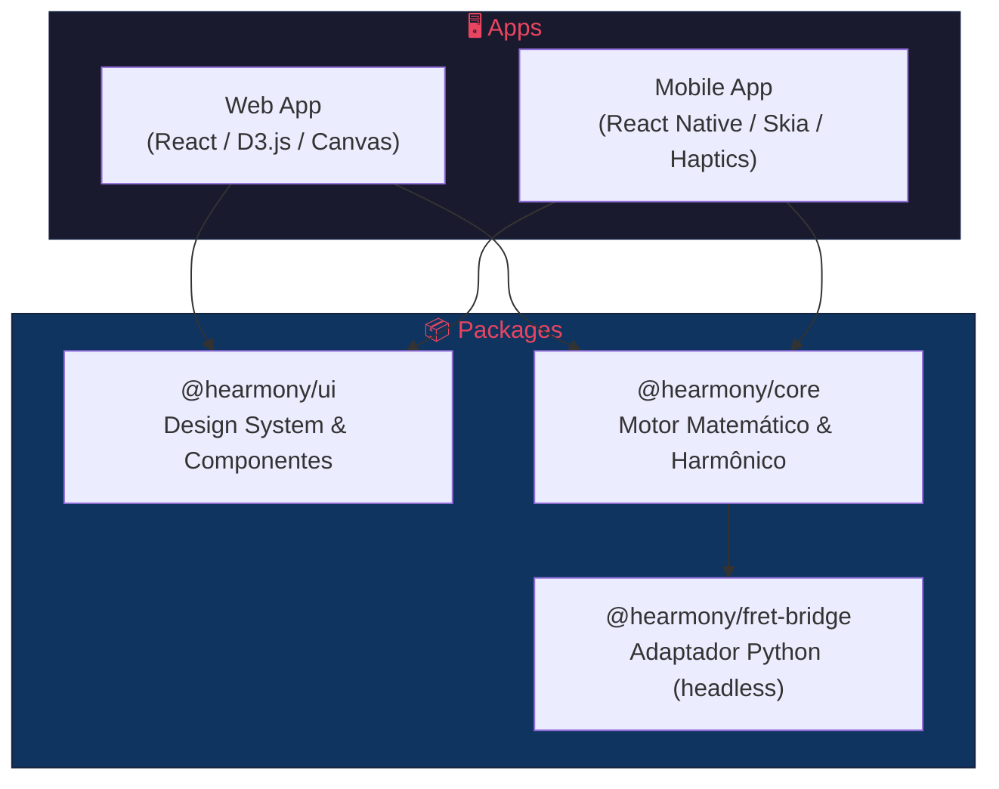
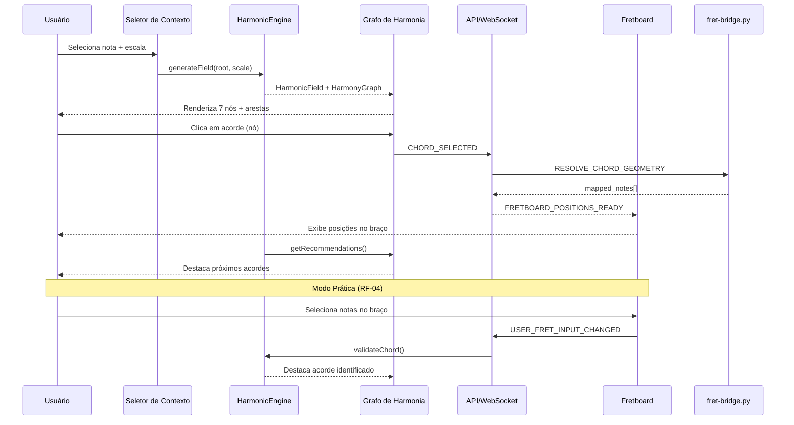

# 🏗️ Arquitetura Técnica — Hearmony

> **Status:** ✅ APPROVED
> **Última atualização:** 2026-06-26

---

## 1. Visão Geral

A plataforma Hearmony é um ecossistema educativo cross-platform que ensina harmonia musical através da **visualização gráfica de campos harmônicos** (grafos ponderados) integrada com um **simulador tátil de braço de instrumento de corda**.

O motor de dados utiliza **matrizes de adjacência ponderadas** para calcular o peso e a probabilidade de movimentos harmônicos (progressões de acordes). O motor visual do braço escuta estas estruturas matemáticas e as traduz em formas geométricas interativas com suporte a **arcos bicolores** para diferenciação de funções harmônicas.

## 2. Diagrama de Camadas



## 3. Princípios Arquiteturais

### 3.1 Isolamento Lógico
Regras de teoria musical **não habitam** componentes de UI. Toda validação cromática ocorre em `@hearmony/core`.

### 3.2 Spec-Driven Development (SDD)
Todo código deve satisfazer as especificações aprovadas. Nenhuma feature é implementada sem spec.

### 3.3 Platform-Agnostic Core
O pacote `core` é puramente lógico, sem dependência de plataforma (DOM, React Native, etc.).

### 3.4 Unidirectional Data Flow
O estado flui em uma direção: `ação → estado → view`. Componentes de UI são reativos ao estado do motor harmônico.

### 3.5 Comunicação Híbrida
WebSocket para interações em tempo real; REST como fallback síncrono para diagnóstico e inicialização.

## 4. Estrutura do Monorepo

```text
hearmony/
├── specs/                     # Especificações técnicas (SDD)
│   ├── epics/
│   │   ├── 01-nucleo-matematico/
│   │   │   ├── SPEC-1.01-matriz-adjacencia.md
│   │   │   ├── SPEC-1.02-motor-harmonico.md
│   │   │   └── SPEC-1.03-validador-cromatico.md
│   │   ├── 02-estado-afinacao/
│   │   │   ├── SPEC-2.01-sistema-afinacao.md
│   │   │   └── SPEC-2.02-gerenciamento-estado.md
│   │   ├── 03-renderizacao-ui/
│   │   │   ├── SPEC-3.01-design-system.md
│   │   │   ├── SPEC-3.02-renderizacao-fretboard.md
│   │   │   └── SPEC-3.03-api-integracao.md
│   │   └── 04-cross-platform/
│   │       └── SPEC-4.01-mobile-skia.md
│   ├── _template.md
│   ├── glossary.md
│   └── architecture.md
├── packages/
│   ├── core/                  # Motor matemático, validadores, engine
│   ├── ui/                    # Design system, componentes visuais
│   └── fret-bridge/           # Adaptador Python (fret_bridge.py headless)
├── apps/
│   ├── web/                   # Frontend React (D3.js, Canvas)
│   └── mobile/                # React Native (Skia, Haptics) — fase futura
├── docs/                      # Diagramas, schemas JSON, manuais
└── package.json
```

## 5. Mapeamento Requisitos → Specs → Pacotes

| Requisito | Spec | Pacote |
|-----------|------|--------|
| RF-01: Seleção de Contexto | SPEC-1.02 | `@hearmony/core` |
| RF-02: Grafo de Harmonia | SPEC-1.01 | `@hearmony/core` |
| RF-03: Interação com Nós | SPEC-3.02 | `@hearmony/ui` + `apps/web` |
| RF-04: Montagem de Acordes | SPEC-1.03 | `@hearmony/core` |
| RF-05: Progressão Recomendada | SPEC-1.02 | `@hearmony/core` |
| RF-06: Afinação Customizável | SPEC-2.01 | `@hearmony/core` |
| RNF-01: Performance | Todas | Transversal |
| RNF-02: Usabilidade | SPEC-3.01 | `@hearmony/ui` |
| RNF-03: Escalabilidade | SPEC-2.01, 2.02 | `@hearmony/core` |
| RNF-04: Integração | SPEC-3.03 | `@hearmony/fret-bridge` |

## 6. Fluxo de Dados Principal



## 7. Stack Tecnológica

| Camada | Tecnologia | Justificativa |
|--------|------------|---------------|
| **Core Logic** | TypeScript (puro) | Platform-agnostic, tipagem forte |
| **Web Rendering** | React + D3.js + Canvas API | Grafos interativos + fretboard via Canvas |
| **Mobile Rendering** | React Native + react-native-skia | GPU-accelerated (fase futura) |
| **Fretboard Engine** | Python (fret_bridge.py) | Baseado no fret.py de referência |
| **Comunicação** | WebSocket + REST fallback | Baixa latência + resiliência |
| **Monorepo** | Turborepo / Nx | Compartilhamento de código |
| **Testes** | Vitest (unit) + Playwright (e2e) | Cobertura completa |
| **Estado** | Zustand ou Redux Toolkit | Fluxo unidirecional reativo |
