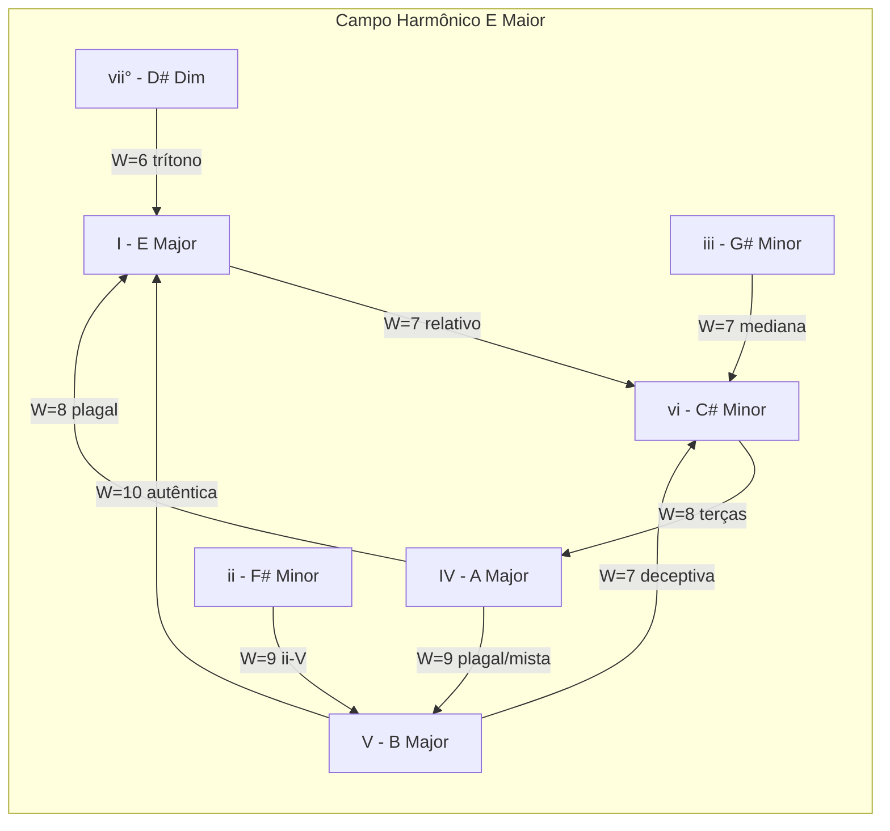

# SPEC-1.01 — Matriz de Adjacência Harmônica

> **Status:** ✅ APPROVED
> **Épico:** 1 — Núcleo Matemático e Motor de Harmonia
> **Autor:** Lans-Anls
> **Criado em:** 2026-06-26
> **Última atualização:** 2026-06-26

---

## 1. Resumo

Define a estrutura matemática central da plataforma: uma **matriz de adjacência ponderada e direcionada** que modela as relações entre acordes diatônicos de um campo harmônico. Os pesos representam a probabilidade e a afinidade de transição entre acordes, baseados em regras reais de condução de vozes e cadências.

## 2. Motivação

A plataforma necessita de uma representação computacional das relações harmônicas que permita:
- Renderizar grafos visuais com arestas ponderadas (RF-02)
- Calcular recomendações de progressão (RF-05)
- Servir como modelo de dados para todos os componentes downstream (UI, API, fretboard)

Sem esta fundação matemática, o grafo seria arbitrário e as recomendações não teriam embasamento teórico.

## 3. Definições e Glossário

| Termo | Definição |
|-------|-----------|
| **Matriz de Adjacência** | Matriz quadrada 7×7 onde M[i][j] indica o peso da transição do acorde i para o acorde j |
| **Peso (W)** | Valor de 1 a 10 representando a força da relação harmônica (10 = máxima afinidade) |
| **Cadência** | Movimento harmônico padronizado (autêntica, plagal, deceptiva, etc.) |
| **Voice Leading** | Técnica de condução de vozes que minimiza o movimento entre notas de acordes consecutivos |
| **Grau Diatônico** | Posição do acorde na escala (I, ii, iii, IV, V, vi, vii°) |

## 4. Requisitos Funcionais

### RF-02: Visualização do Grafo de Harmonia

- **Descrição:** O grafo renderiza acordes diatônicos como nós interligados por arestas ponderadas.
- **Entrada:** Campo harmônico com tonalidade e tipo de escala.
- **Saída esperada:** Grafo com exatamente 7 nós e arestas ponderadas direcionais.
- **Regras de negócio:**
  - Cada nó exibe: grau romano, nome do acorde e qualidade.
  - As arestas conectam acordes por movimento harmônico com pesos definidos.

### Regras de Negócio — Movimentos Harmônicos

#### Movimentos Primários (Peso ≥ 8)

| Movimento | Exemplo (E Maior) | Direção | Peso | Justificativa |
|-----------|-------------------|---------|------|---------------|
| Cadência Autêntica | V → I (B → E) | Direto | 10 | Resolução de máxima tensão (trítono → tônica) |
| Preparação ii-V | ii → V (F#m → B) | Direto | 9 | Quarta justa ascendente (ciclo de quintas) |
| Cadência Plagal/Mista | IV → V (A → B) | Direto | 9 | Condução subdominante → dominante |
| Preparação Plagal | IV → I (A → E) | Direto | 8 | Resolução sem trítono |
| Progressão por Terças | vi → IV (C#m → A) | Direto | 8 | Condução fluida, preparação subdominante |

#### Movimentos Secundários (Peso 5–7)

| Movimento | Exemplo (E Maior) | Direção | Peso | Justificativa |
|-----------|-------------------|---------|------|---------------|
| Afastamento Relativo | I → vi (E → C#m) | Bidirecional | 7 | Duas notas em comum (função tônica secundária) |
| Cadência Deceptiva | V → vi (B → C#m) | Direto | 7 | Resolução frustrada da dominante |
| Passagem Mediana | iii → vi (G#m → C#m) | Direto | 7 | Quarta ascendente da mediante |
| Substituição de Trítono | vii° → I (D#° → E) | Direto | 6 | Função dominante, menor estabilidade |

#### Movimentos de Conexão (Peso ≤ 4)

| Movimento | Exemplo (E Maior) | Direção | Peso | Justificativa |
|-----------|-------------------|---------|------|---------------|
| Eixo de Conexão Fraca | iii → IV (G#m → A) | Direto | 4 | Tom adjacente, transição de bloco |

## 5. Estrutura da Matriz

### Matriz de Adjacência Teórica (Escala Maior)

Valores onde `0` indica ausência de aresta direta:

```
       I    ii   iii   IV    V    vi   vii°
I   [  0,    3,    0,    8,   10,    5,    6 ]
ii  [  5,    0,    0,    0,    0,    7,    0 ]
iii [  4,    0,    0,    0,    0,    3,    0 ]
IV  [  8,    4,    5,    0,    3,    8,    0 ]
V   [  6,    9,    0,    9,    0,    4,    0 ]
vi  [  7,    0,    7,    3,    7,    0,    0 ]
vii°[  0,    0,    0,    5,    0,    0,    0 ]
```

> **Nota:** Esta é a matriz base para tonalidades maiores. Matrizes para menores (natural, harmônica, melódica) serão derivadas com ajustes nos pesos conforme alterações de grau.

## 6. Interface / Contrato

```typescript
/**
 * Nó do Grafo — representa um acorde diatônico
 */
interface GraphNode {
  chordId: string;              // ex: "E_MAJ_I"
  chord: Chord;                 // referência ao acorde completo
  position: { x: number; y: number };  // coordenadas de renderização
}

/**
 * Aresta do Grafo — conexão ponderada entre dois acordes
 */
interface GraphEdge {
  source: string;               // chordId de origem
  target: string;               // chordId de destino
  weight: number;               // 1-10, força da relação harmônica
  movement: HarmonicMovement;   // tipo de cadência/movimento
}

/**
 * Tipos de movimento harmônico
 */
type HarmonicMovement =
  | "authentic"           // V → I
  | "plagal"              // IV → I
  | "plagal_mixed"        // IV → V
  | "deceptive"           // V → vi
  | "preparation_ii_V"    // ii → V
  | "relative"            // I ↔ vi
  | "tritone_sub"         // vii° → I
  | "mediant_passage"     // iii → vi
  | "tertian_progression" // vi → IV
  | "weak_connection";    // iii → IV

/**
 * Grafo de Harmonia completo
 */
interface HarmonyGraph {
  nodes: GraphNode[];
  edges: GraphEdge[];
  adjacencyMatrix: number[][];  // matriz 7x7
}
```

## 7. Critérios de Aceite

- [ ] CA-01: Matriz 7×7 é gerada para qualquer tonalidade maior com pesos conforme tabela.
- [ ] CA-02: Todos os movimentos primários (peso ≥ 8) possuem arestas no grafo.
- [ ] CA-03: Valor `0` na matriz resulta em ausência de aresta na renderização.
- [ ] CA-04: Grafo contém exatamente 7 nós para campos diatônicos.
- [ ] CA-05: Pesos são simétricos apenas onde indicado "Bidirecional" na tabela.
- [ ] CA-06: Matrizes para escalas menores derivam da base maior com ajustes documentados.

## 8. Dependências

| Spec | Relação |
|------|---------|
| SPEC-1.02 | Consome a matriz para calcular recomendações |
| SPEC-3.01 | Consome pesos para definir espessura visual das arestas |

## 9. Diagramas



## 10. Histórico de Revisões

| Versão | Data | Autor | Descrição da Mudança |
|--------|------|-------|---------------------|
| 1.0 | 2026-06-26 | Lans-Anls | Consolidação de sessões anteriores (Seções 9, 9.1, 9.2) |
