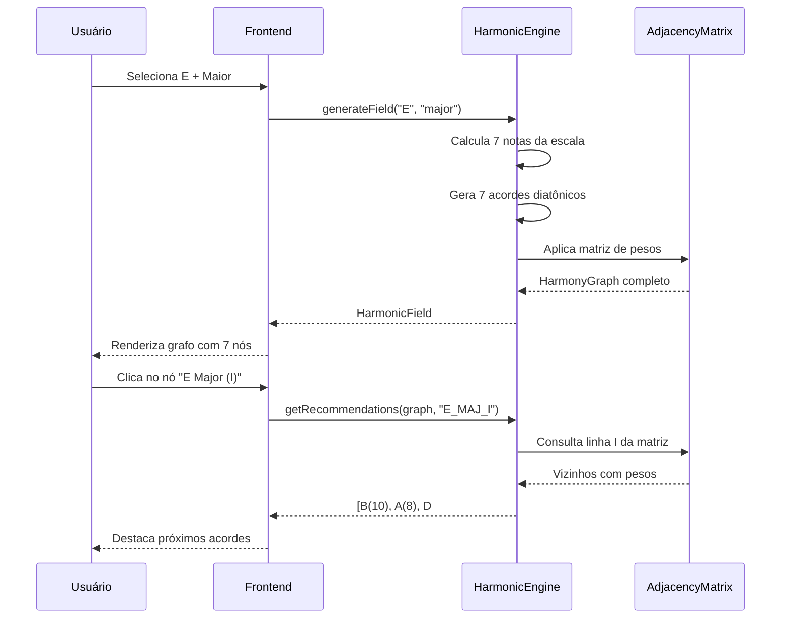

# SPEC-1.02 — Motor Harmônico e Recomendação

> **Status:** ✅ APPROVED
> **Épico:** 1 — Núcleo Matemático e Motor de Harmonia
> **Autor:** Lans-Anls
> **Criado em:** 2026-06-26
> **Última atualização:** 2026-06-26

---

## 1. Resumo

Define o motor computacional central (`HarmonicEngine`) responsável por:
- Gerar campos harmônicos a partir de uma nota raiz e tipo de escala (RF-01)
- Calcular recomendações de progressão com base na matriz de adjacência (RF-05)
- Suportar cálculo dinâmico de pesos por voice leading quando o usuário modula de escala

## 2. Motivação

O motor harmônico é o coração da plataforma. Ele conecta a seleção de contexto do usuário (nota + escala) à geração do campo harmônico completo e às recomendações de progressão. Sem ele, o grafo seria estático e não interativo.

## 3. Definições e Glossário

| Termo | Definição |
|-------|-----------|
| **Campo Harmônico** | Conjunto dos 7 acordes diatônicos derivados de uma escala, com suas relações |
| **Escala Cromática** | Série de 12 semitons: C, C#, D, D#, E, F, F#, G, G#, A, A#, B |
| **Intervalo** | Distância em semitons entre duas notas |
| **Tríade** | Acorde de 3 notas (fundamental, 3ª, 5ª) |
| **Tétrade** | Acorde de 4 notas (fundamental, 3ª, 5ª, 7ª) |

## 4. Requisitos Funcionais

### RF-01: Seleção de Contexto Harmônico

- **Descrição:** O usuário seleciona uma nota raiz e um tipo de escala. O sistema gera o campo harmônico completo.
- **Entrada:** Nota raiz (C–B, 12 opções) + tipo de escala (maior, menor natural, menor harmônica).
- **Saída esperada:** Campo harmônico com 7 acordes diatônicos + grafo de relações.
- **Regras de negócio:**
  - Mínimo 12 notas disponíveis (escala cromática completa)
  - Mínimo 3 modos de escala suportados
  - Campo harmônico carrega em menos de 500ms
  - Grafo renderiza com exatamente 7 nós (I ao vii)

#### Fórmulas de Escalas

| Escala | Intervalos (semitons) | Qualidades dos Graus |
|--------|----------------------|---------------------|
| Maior | 0, 2, 4, 5, 7, 9, 11 | Maj, min, min, Maj, Maj, min, dim |
| Menor Natural | 0, 2, 3, 5, 7, 8, 10 | min, dim, Maj, min, min, Maj, Maj |
| Menor Harmônica | 0, 2, 3, 5, 7, 8, 11 | min, dim, aug, min, Maj, Maj, dim |

### RF-05: Progressão Harmônica Recomendada

- **Descrição:** Dado um acorde selecionado, o sistema identifica seus vizinhos no grafo e os ordena por peso.
- **Entrada:** `chordId` do acorde atualmente selecionado.
- **Saída esperada:** Lista ordenada de próximos acordes possíveis com peso e tipo de movimento.
- **Regras de negócio:**
  - Filtra apenas arestas de saída do nó atual (direcionadas)
  - Ordena decrescentemente por peso (W)
  - Retorna o nó de destino completo com metadados

#### Exemplo Concreto (E Maior, acorde I selecionado)

| Posição | Acorde Sugerido | Grau | Peso | Movimento |
|---------|----------------|------|------|-----------|
| 1º | B Major | V | 10 | Dominante |
| 2º | A Major | IV | 8 | Subdominante |
| 3º | D# Dim | vii° | 6 | Substituição de trítono |
| 4º | C# Minor | vi | 5 | Relativo menor |
| 5º | F# Minor | ii | 3 | Preparação secundária |

## 5. Requisitos Não-Funcionais

- **Performance:** Geração de campo harmônico em < 500ms. Cálculo de recomendações em < 100ms.
- **Compatibilidade:** Lógica pura TypeScript, sem dependência de plataforma (DOM, React, etc.).
- **Extensibilidade:** Suporte à adição de novos tipos de escala sem refatoração.

## 6. Interface / Contrato

```typescript
/**
 * Nota Musical — unidade atômica do domínio
 */
interface Note {
  name: string;           // "C", "C#", "D", ..., "B"
  position: number;       // 0–11 na oitava cromática
  frequency?: number;     // Hz (opcional, para afinação)
}

/**
 * Acorde — agregação de notas com função harmônica
 */
interface Chord {
  name: string;           // "E Major", "F# Minor"
  degree: string;         // "I", "ii", "iii", "IV", "V", "vi", "vii°"
  root: Note;
  quality: "major" | "minor" | "diminished" | "augmented";
  intervals: number[];    // [0, 4, 7] tríade, [0, 4, 7, 10] tétrade
  notes: Note[];
}

/**
 * Campo Harmônico — resultado da seleção de contexto
 */
interface HarmonicField {
  tonality: Note;
  scaleType: "major" | "minor_natural" | "minor_harmonic" | "minor_melodic";
  scaleNotes: Note[];     // 7 notas da escala
  chords: Chord[];        // 7 acordes diatônicos
  graph: HarmonyGraph;    // grafo ponderado (SPEC-1.01)
}

/**
 * Resultado de recomendação — acorde sugerido com metadados
 */
interface Recommendation {
  targetNode: GraphNode;
  edge: GraphEdge;
}

/**
 * Motor Harmônico — serviço principal
 */
interface IHarmonicEngine {
  /** Gera campo harmônico completo a partir de nota raiz + escala */
  generateField(root: Note, scaleType: HarmonicField["scaleType"]): HarmonicField;

  /** Retorna recomendações ordenadas por peso */
  getRecommendations(graph: HarmonyGraph, currentChordId: string): Recommendation[];

  /** Calcula peso dinâmico entre dois acordes por voice leading */
  calculateDynamicWeight(source: Chord, target: Chord): number;
}
```

## 7. Critérios de Aceite

- [ ] CA-01: `generateField("E", "major")` retorna campo com 7 acordes corretos (E, F#m, G#m, A, B, C#m, D#°).
- [ ] CA-02: `generateField` funciona para todas as 12 notas cromáticas.
- [ ] CA-03: `generateField` suporta pelo menos 3 tipos de escala.
- [ ] CA-04: `getRecommendations` retorna lista ordenada decrescentemente por peso.
- [ ] CA-05: `getRecommendations` filtra apenas arestas de saída (não de entrada).
- [ ] CA-06: `calculateDynamicWeight` retorna valor entre 1 e 10.
- [ ] CA-07: `calculateDynamicWeight` aplica bônus para notas em comum (voice leading).
- [ ] CA-08: `calculateDynamicWeight` aplica bônus para intervalos de 4ª/5ª justa.
- [ ] CA-09: Tempo de execução de `generateField` < 500ms.
- [ ] CA-10: Tempo de execução de `getRecommendations` < 100ms.

## 8. Dependências

| Spec | Relação |
|------|---------|
| SPEC-1.01 | Utiliza a matriz de adjacência para popular `HarmonyGraph` |
| SPEC-1.03 | Utiliza o validador para confirmar acordes formados |
| SPEC-2.01 | Recebe a afinação ativa para cálculos de fretboard |

## 9. Diagramas



## 10. Histórico de Revisões

| Versão | Data | Autor | Descrição da Mudança |
|--------|------|-------|---------------------|
| 1.0 | 2026-06-26 | Lans-Anls | Consolidação de RF-01, RF-05, Seção 9.3 |
