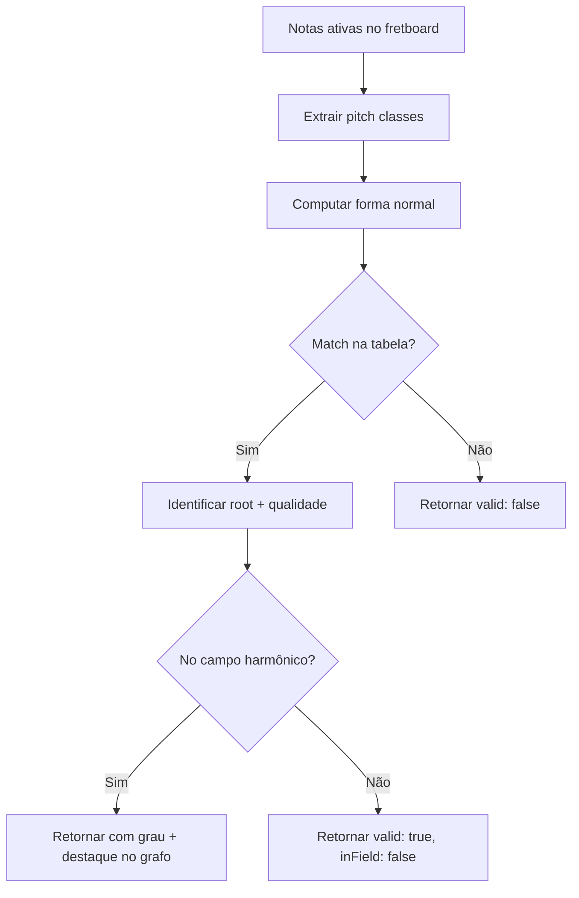

# SPEC-1.03 — Validador Cromático

> **Status:** ✅ APPROVED
> **Épico:** 1 — Núcleo Matemático e Motor de Harmonia
> **Autor:** Lans-Anls
> **Criado em:** 2026-06-26
> **Última atualização:** 2026-06-26

---

## 1. Resumo

Define o módulo de validação reversa que, dado um conjunto de notas selecionadas no braço do instrumento, identifica se formam um acorde válido (tríade ou tétrade), classifica sua qualidade e localiza sua posição no campo harmônico ativo.

## 2. Motivação

O modo de montagem interativa (RF-04) exige que o sistema valide em tempo real se as notas que o usuário toca/seleciona no fretboard formam um acorde reconhecível. Sem este validador, a plataforma não consegue fechar o loop bidirecional entre o grafo e o braço do instrumento.

## 3. Definições e Glossário

| Termo | Definição |
|-------|-----------|
| **Validação Reversa** | Processo de identificar um acorde a partir de notas individuais (bottom-up) |
| **Pitch Class** | Classe de altura — nota sem oitava (0–11 no espaço cromático) |
| **Normal Form** | Representação canônica compacta de um conjunto de pitch classes |
| **Inversão** | Reordenação das notas de um acorde onde a fundamental não é a nota mais grave |

## 4. Requisitos Funcionais

### RF-04: Montagem Interativa de Acordes

- **Descrição:** O usuário interage com o braço virtual e o sistema identifica o acorde formado.
- **Entrada:** Array de notas ativas no fretboard (pitch classes).
- **Saída esperada:** Acorde identificado com nome, qualidade, grau no campo e posição no grafo.
- **Regras de negócio:**
  - Aceita apenas tríades (3 notas) e tétrades (4 notas)
  - Suporta cordas soltas (fret = 0) e pressionadas (fret 1–24)
  - Posições alternativas limitadas a 5 casas de distância
  - Identifica inversões (1ª e 2ª inversão para tríades, 1ª, 2ª e 3ª para tétrades)
  - Se o acorde pertence ao campo harmônico ativo, destaca no grafo
  - Se não pertence, indica como "fora do campo" sem erro

### Tabela de Reconhecimento de Acordes

| Intervalos (semitons) | Qualidade | Exemplo |
|----------------------|-----------|---------|
| [0, 4, 7] | Maior | C, E, G |
| [0, 3, 7] | Menor | C, Eb, G |
| [0, 3, 6] | Diminuto | C, Eb, Gb |
| [0, 4, 8] | Aumentado | C, E, G# |
| [0, 4, 7, 11] | Maior com 7ª maior | C, E, G, B |
| [0, 4, 7, 10] | Dominante (7ª menor) | C, E, G, Bb |
| [0, 3, 7, 10] | Menor com 7ª menor | C, Eb, G, Bb |
| [0, 3, 6, 9] | Diminuto com 7ª diminuta | C, Eb, Gb, A |

### Algoritmo de Identificação

1. Extrair pitch classes únicas das notas ativas (remover oitavas duplicadas)
2. Computar a forma normal (menor intervalo total)
3. Testar todas as rotações contra a tabela de intervalos conhecidos
4. Se houver match, a rotação que combinou determina a fundamental (root)
5. Verificar se o acorde pertence ao campo harmônico ativo
6. Retornar resultado com confiança

## 5. Requisitos Não-Funcionais

- **Performance:** Validação completa em < 50ms (operação frequente durante interação).
- **Precisão:** 100% de acerto para tríades e tétrades padrão (sem ambiguidade enarmônica não resolvida).

## 6. Interface / Contrato

```typescript
/**
 * Entrada: notas ativas vindas do fretboard
 */
interface FretInput {
  activeFrets: Array<{
    stringNumber: number;
    fret: number;       // 0 = corda solta, 1-24 = casa
  }>;
  instrument: "guitar" | "ukulele" | "bass4" | "bass5";
  tuning: string[];     // ex: ["E", "A", "D", "G", "B", "E"]
}

/**
 * Resultado da validação
 */
interface ChordValidationResult {
  valid: boolean;
  detectedChord: Chord | null;
  degree: string | null;          // "I", "ii", etc. (null se fora do campo)
  inHarmonicField: boolean;
  inversion: number;              // 0 = posição fundamental, 1 = 1ª inversão, etc.
  confidence: number;             // 0.0–1.0
  alternativeInterpretations?: Chord[];  // acordes ambíguos
}

/**
 * Validador Cromático — serviço de identificação
 */
interface IChromaticValidator {
  /** Identifica acorde a partir de notas do fretboard */
  validateChord(input: FretInput, activeField: HarmonicField): ChordValidationResult;

  /** Converte posições de fretboard em pitch classes */
  fretToNotes(input: FretInput): Note[];

  /** Busca posições alternativas para um acorde no braço */
  findAlternativePositions(
    chord: Chord,
    instrument: FretInput["instrument"],
    tuning: string[],
    maxFretSpan: number    // padrão: 5
  ): FretPosition[][];
}
```

## 7. Critérios de Aceite

- [ ] CA-01: Identifica corretamente todas as tríades maiores, menores, diminutas e aumentadas.
- [ ] CA-02: Identifica corretamente tétrades (7ª maior, dominante, menor com 7ª, diminuta).
- [ ] CA-03: Reconhece inversões (1ª, 2ª para tríades; 1ª, 2ª, 3ª para tétrades).
- [ ] CA-04: Retorna `inHarmonicField: true` quando o acorde pertence ao campo ativo.
- [ ] CA-05: Retorna `inHarmonicField: false` com `valid: true` para acordes corretos fora do campo.
- [ ] CA-06: Rejeita conjuntos com menos de 3 ou mais de 4 notas distintas (pitch classes).
- [ ] CA-07: `findAlternativePositions` respeita limite de `maxFretSpan` casas.
- [ ] CA-08: Tempo de validação < 50ms.

## 8. Dependências

| Spec | Relação |
|------|---------|
| SPEC-1.02 | Recebe `HarmonicField` ativo para verificar pertencimento |
| SPEC-2.01 | Recebe afinação ativa para converter frets em notas |
| SPEC-3.02 | É invocado quando o fretboard envia `USER_FRET_INPUT_CHANGED` |

## 9. Diagramas



## 10. Histórico de Revisões

| Versão | Data | Autor | Descrição da Mudança |
|--------|------|-------|---------------------|
| 1.0 | 2026-06-26 | Lans-Anls | Consolidação de RF-04, regras de tríades/tétrades |
