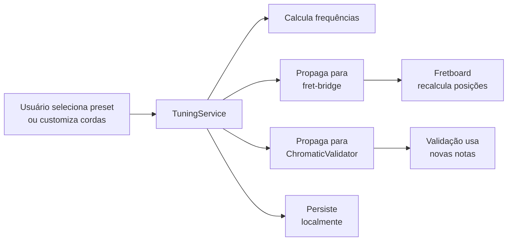

# SPEC-2.01 — Sistema de Afinação Customizável

> **Status:** ✅ APPROVED
> **Épico:** 2 — Gerenciamento de Estado e Afinação
> **Autor:** Lans-Anls
> **Criado em:** 2026-06-26
> **Última atualização:** 2026-06-26

---

## 1. Resumo

Define o sistema de afinação que permite ao usuário configurar a afinação das cordas do instrumento de forma manual (presets e customizada) e, futuramente, via análise de frequência em tempo real. A afinação ativa alimenta todos os cálculos de posição no fretboard.

## 2. Motivação

Instrumentos de corda possuem múltiplas afinações válidas (standard, drop D, open G, DADGAD, etc.). O sistema precisa suportar essa flexibilidade para que os cálculos de posição no braço e a visualização de notas sejam corretos para qualquer configuração. Sem isso, a plataforma seria limitada a uma única afinação fixa.

## 3. Definições e Glossário

| Termo | Definição |
|-------|-----------|
| **Afinação Standard** | Guitarra: E-A-D-G-B-E; Baixo 4: E-A-D-G; Baixo 5: B-E-A-D-G |
| **Drop Tuning** | Afinação onde a corda mais grave é abaixada (ex: Drop D = D-A-D-G-B-E) |
| **Open Tuning** | Afinação que forma um acorde quando todas as cordas são tocadas soltas |
| **Capotraste** | Dispositivo que eleva uniformemente a afinação em N semitons |
| **Frequência Fundamental** | Vibração principal de uma corda que define sua nota (ex: A4 = 440Hz) |

## 4. Requisitos Funcionais

### RF-06: Sistema de Afinação Customizável

- **Descrição:** O usuário pode selecionar presets de afinação ou customizar individualmente cada corda.
- **Entrada:** Seleção de preset ou configuração manual (nota por corda).
- **Saída esperada:** Afinação ativa propagada para todos os cálculos do sistema.
- **Regras de negócio:**
  - Presets obrigatórios: Standard, Drop D, Open G, Open D, DADGAD
  - Customização permite qualquer nota cromática em qualquer corda
  - Suporte a 4, 5 e 6 cordas
  - Suporte a capotraste (offset de N semitons em todas as cordas)
  - Alteração de afinação recalcula todas as posições do fretboard em tempo real

### Presets de Afinação

#### Guitarra (6 cordas)
| Preset | Cordas (grave → aguda) |
|--------|----------------------|
| Standard | E, A, D, G, B, E |
| Drop D | D, A, D, G, B, E |
| Open G | D, G, D, G, B, D |
| Open D | D, A, D, F#, A, D |
| DADGAD | D, A, D, G, A, D |
| Half-Step Down | Eb, Ab, Db, Gb, Bb, Eb |

#### Baixo (4 cordas)
| Preset | Cordas |
|--------|--------|
| Standard | E, A, D, G |
| Drop D | D, A, D, G |

#### Baixo (5 cordas)
| Preset | Cordas |
|--------|--------|
| Standard | B, E, A, D, G |

### Análise de Frequência (Fase futura)

> **Nota:** Este sub-requisito é planejado para implementação futura e não bloqueia o MVP.

- Captura de áudio via microfone (Web Audio API / React Native)
- Detecção de frequência fundamental via autocorrelação ou FFT
- Sugestão de nota mais próxima e indicação de desvio (cents)
- Feedback visual (afinado / acima / abaixo)

## 5. Requisitos Não-Funcionais

- **Performance:** Recálculo de posições após mudança de afinação em < 200ms.
- **Persistência:** Última afinação utilizada é salva localmente e restaurada na próxima sessão.
- **Compatibilidade:** Funciona em todos os instrumentos suportados (guitar, bass4, bass5, ukulele).

## 6. Interface / Contrato

```typescript
/**
 * Configuração de afinação de um instrumento
 */
interface TuningConfig {
  instrument: "guitar" | "ukulele" | "bass4" | "bass5";
  strings: TuningString[];
  capo: number;               // 0 = sem capo, 1-12 = posição do capotraste
  presetName: string | null;  // null = customizado
}

/**
 * Afinação de uma corda individual
 */
interface TuningString {
  stringNumber: number;      // 1 = mais aguda, 6 = mais grave (guitarra)
  note: string;              // "E", "D", etc.
  octave: number;            // ex: 2 para E2 (6ª corda guitarra)
  frequency: number;         // Hz calculado
}

/**
 * Preset de afinação
 */
interface TuningPreset {
  id: string;
  name: string;              // "Standard", "Drop D", etc.
  instrument: TuningConfig["instrument"];
  notes: string[];           // grave → aguda: ["E", "A", "D", "G", "B", "E"]
}

/**
 * Serviço de Afinação
 */
interface ITuningService {
  /** Retorna lista de presets para o instrumento */
  getPresets(instrument: TuningConfig["instrument"]): TuningPreset[];

  /** Aplica preset de afinação */
  applyPreset(presetId: string): TuningConfig;

  /** Configura afinação customizada */
  setCustomTuning(strings: Array<{ stringNumber: number; note: string }>): TuningConfig;

  /** Aplica capotraste */
  setCapo(fret: number): TuningConfig;

  /** Retorna a nota real de uma corda em um traste específico */
  getNoteAt(stringNumber: number, fret: number): Note;

  /** Salva afinação ativa localmente */
  persist(): void;

  /** Restaura última afinação salva */
  restore(): TuningConfig | null;
}
```

## 7. Critérios de Aceite

- [ ] CA-01: Todos os presets listados estão disponíveis e funcionais.
- [ ] CA-02: Customização permite selecionar qualquer nota cromática em qualquer corda.
- [ ] CA-03: `getNoteAt(6, 0)` com tuning Standard retorna "E".
- [ ] CA-04: `getNoteAt(6, 5)` com tuning Standard retorna "A".
- [ ] CA-05: Capo em fret 2 com Standard resulta em "F#, B, E, A, C#, F#".
- [ ] CA-06: Mudança de afinação recalcula todas as posições em < 200ms.
- [ ] CA-07: Afinação é persistida e restaurada entre sessões.
- [ ] CA-08: Suporte funcional para guitar, bass4, bass5.

## 8. Dependências

| Spec | Relação |
|------|---------|
| SPEC-1.03 | O validador usa a afinação para converter frets em notas |
| SPEC-3.02 | O fretboard usa a afinação para renderizar notas corretas |

## 9. Diagramas



## 10. Histórico de Revisões

| Versão | Data | Autor | Descrição da Mudança |
|--------|------|-------|---------------------|
| 1.0 | 2026-06-26 | Lans-Anls | Consolidação de RF-06, sistema de afinação com presets |
