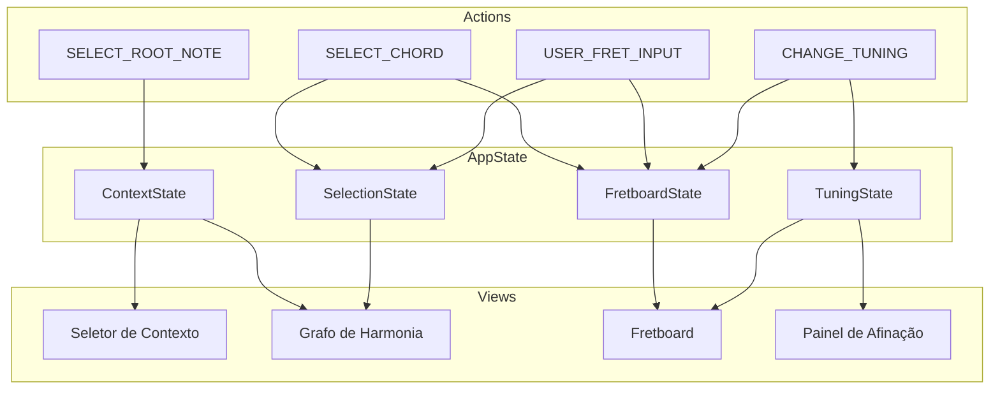

# SPEC-2.02 — Gerenciamento de Estado Global

> **Status:** ✅ APPROVED
> **Épico:** 2 — Gerenciamento de Estado e Afinação
> **Autor:** Lans-Anls
> **Criado em:** 2026-06-26
> **Última atualização:** 2026-06-26

---

## 1. Resumo

Define o modelo de estado global reativo da plataforma, que centraliza e sincroniza o estado entre os componentes (grafo, fretboard, seletor de contexto, afinação). Garante fluxo de dados unidirecional e consistência entre todas as views.

## 2. Motivação

A plataforma possui múltiplos componentes interdependentes: o seletor de contexto alimenta o motor harmônico, que gera o grafo, que comunica com o fretboard, que por sua vez retroalimenta o validador. Sem um estado centralizado e reativo, a sincronização se torna frágil e propensa a inconsistências.

## 3. Definições e Glossário

| Termo | Definição |
|-------|-----------|
| **Estado Global** | Objeto centralizado que contém toda a informação de contexto da sessão |
| **Fluxo Unidirecional** | Padrão onde dados fluem em uma só direção: ação → estado → view |
| **Reatividade** | Componentes re-renderizam automaticamente quando o estado que observam muda |
| **Slice** | Fatia isolada do estado global com seu próprio reducer/mutator |

## 4. Requisitos Funcionais

### Estrutura do Estado Global

O estado é dividido em slices isolados, cada um com responsabilidade única:

#### Slice: Context (Contexto Harmônico)
- Nota raiz selecionada
- Tipo de escala selecionada
- Campo harmônico ativo (resultado de `generateField`)
- Grafo ativo com nós e arestas

#### Slice: Selection (Seleção Ativa)
- Acorde selecionado no grafo (ou null)
- Recomendações de progressão calculadas
- Modo de visualização ativo (exploração / prática)

#### Slice: Fretboard (Estado do Braço)
- Posições mapeadas para o acorde selecionado
- Notas ativas (quando em modo prática / montagem)
- Resultado de validação do acorde montado
- Cor secundária ativa (arcos bicolores) ou null

#### Slice: Tuning (Afinação)
- Configuração de afinação ativa
- Instrumento selecionado
- Posição do capotraste

### Fluxo de Ações

| Ação | Slice Afetado | Efeito Colateral |
|------|--------------|------------------|
| `SELECT_ROOT_NOTE` | Context | Recalcula campo harmônico + grafo |
| `SELECT_SCALE_TYPE` | Context | Recalcula campo harmônico + grafo |
| `SELECT_CHORD` | Selection + Fretboard | Calcula recomendações + envia acorde ao bridge |
| `CLEAR_SELECTION` | Selection + Fretboard | Limpa destaque e posições |
| `USER_FRET_INPUT` | Fretboard + Selection | Valida acorde + destaca no grafo |
| `CHANGE_TUNING` | Tuning + Fretboard | Recalcula todas as posições |
| `SET_CAPO` | Tuning + Fretboard | Recalcula com offset |
| `CLEAR_SECONDARY_COLOR` | Fretboard | Remove arcos bicolores (botão direito) |
| `CHANGE_INSTRUMENT` | Tuning + Context | Recarrega presets + recalcula |

## 5. Requisitos Não-Funcionais

- **Performance:** Propagação de estado para views em < 16ms (60fps).
- **Consistência:** Nenhum componente pode ler estado stale (desatualizado).
- **Persistência:** Slices `Tuning` e `Context` persistem entre sessões (localStorage/AsyncStorage).
- **Testabilidade:** Estado é serializável e reproduzível (facilita testes unitários e snapshots).

## 6. Interface / Contrato

```typescript
/**
 * Estado Global da Aplicação
 */
interface AppState {
  context: ContextState;
  selection: SelectionState;
  fretboard: FretboardState;
  tuning: TuningState;
}

interface ContextState {
  rootNote: Note | null;
  scaleType: HarmonicField["scaleType"] | null;
  harmonicField: HarmonicField | null;
}

interface SelectionState {
  selectedChordId: string | null;
  recommendations: Recommendation[];
  mode: "exploration" | "practice";
}

interface FretboardState {
  mappedPositions: FretPosition[][] | null;
  activeInputFrets: Array<{ stringNumber: number; fret: number }>;
  validationResult: ChordValidationResult | null;
  secondaryColor: string | null;    // cor do arco bicolor ativo
}

interface TuningState {
  config: TuningConfig;
  instrument: TuningConfig["instrument"];
}

/**
 * Tipos de Ação
 */
type AppAction =
  | { type: "SELECT_ROOT_NOTE"; payload: Note }
  | { type: "SELECT_SCALE_TYPE"; payload: HarmonicField["scaleType"] }
  | { type: "SELECT_CHORD"; payload: string }           // chordId
  | { type: "CLEAR_SELECTION" }
  | { type: "USER_FRET_INPUT"; payload: FretInput }
  | { type: "CHANGE_TUNING"; payload: TuningConfig }
  | { type: "SET_CAPO"; payload: number }
  | { type: "CLEAR_SECONDARY_COLOR" }
  | { type: "CHANGE_INSTRUMENT"; payload: TuningConfig["instrument"] };
```

## 7. Critérios de Aceite

- [ ] CA-01: `SELECT_ROOT_NOTE` + `SELECT_SCALE_TYPE` gera `harmonicField` não-nulo.
- [ ] CA-02: `SELECT_CHORD` popula `recommendations` e `mappedPositions`.
- [ ] CA-03: `CLEAR_SELECTION` zera `selectedChordId`, `recommendations` e `mappedPositions`.
- [ ] CA-04: `USER_FRET_INPUT` dispara validação e popula `validationResult`.
- [ ] CA-05: `CHANGE_TUNING` recalcula `mappedPositions` se há acorde selecionado.
- [ ] CA-06: `CLEAR_SECONDARY_COLOR` remove arcos bicolores instantaneamente.
- [ ] CA-07: Estado `Tuning` e `Context` persistem entre recarregamentos.
- [ ] CA-08: Propagação de estado não excede 16ms.

## 8. Dependências

| Spec | Relação |
|------|---------|
| SPEC-1.02 | Invocado nas ações `SELECT_ROOT_NOTE` e `SELECT_SCALE_TYPE` |
| SPEC-1.03 | Invocado na ação `USER_FRET_INPUT` |
| SPEC-2.01 | Invocado nas ações `CHANGE_TUNING`, `SET_CAPO`, `CHANGE_INSTRUMENT` |
| SPEC-3.02 | Consome `FretboardState` para renderização |
| SPEC-3.03 | Envia/recebe payloads WebSocket nas ações de fretboard |

## 9. Diagramas



## 10. Histórico de Revisões

| Versão | Data | Autor | Descrição da Mudança |
|--------|------|-------|---------------------|
| 1.0 | 2026-06-26 | Lans-Anls | Consolidação do fluxo de dados e estado global |
