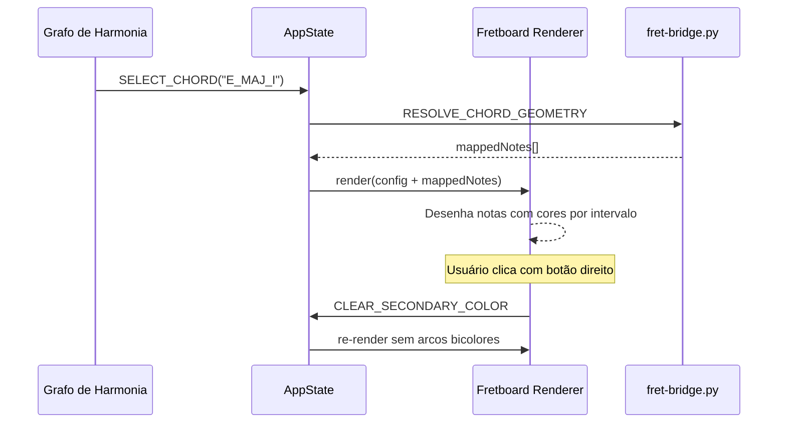

# SPEC-3.02 — Renderização do Fretboard

> **Status:** ✅ APPROVED
> **Épico:** 3 — Renderização Gráfica e UI
> **Autor:** Lans-Anls
> **Criado em:** 2026-06-26
> **Última atualização:** 2026-06-26

---

## 1. Resumo

Define a renderização web do braço do instrumento, baseada na lógica do `fret.py` original. Cobre a conversão de coordenadas Tkinter para Canvas/SVG, o sistema de hitboxes interativas, arcos bicolores e a sincronização bidirecional entre o fretboard e o grafo de harmonia.

## 2. Motivação

O `fret.py` é a implementação de referência do fretboard em Tkinter/Python. A plataforma web precisa replicar fielmente esta lógica visual — posicionamento de notas, cores por intervalo, arcos bicolores e interatividade — traduzindo para HTML5 Canvas API e integrando com o grafo harmônico via estado global.

## 3. Definições e Glossário

| Termo | Definição |
|-------|-----------|
| **Hitbox** | Área clicável/tocável que detecta interação do usuário com uma nota no braço |
| **Arco Bicolor** | Nota renderizada com dois semicírculos: cor primária (acorde atual) e secundária (próximo sugerido) |
| **Traste (Fret)** | Barra metálica perpendicular às cordas que define posições de nota |
| **Corda Solta** | Corda tocada sem pressionar nenhum traste (fret = 0) |
| **fret.py** | Script Python de referência que implementa o fretboard em Tkinter |

## 4. Requisitos Funcionais

### RF-03: Interação com Nós do Grafo (impacto no Fretboard)

- **Descrição:** Quando o usuário clica em um nó do grafo, o fretboard atualiza para mostrar as posições do acorde.
- **Entrada:** Acorde selecionado via evento `CHORD_SELECTED`.
- **Saída esperada:** Posições do acorde mapeadas e destacadas visualmente no braço.
- **Regras de negócio:**
  - Atualização em sincronismo com a seleção (< 300ms)
  - Exibe todas as posições viáveis dentro do limite de casas
  - Notas exibem label (nome da nota ou intervalo) centralizado

### Varredura de Notas (lógica `fret.py`)

O algoritmo de mapeamento segue a lógica exata do `fret.py`:

1. Para cada corda (iteração reversa, da mais aguda para a mais grave):
2. Para cada traste (0 ao total de trastes):
3. Calcular o índice cromático: `(nota_base_corda + traste) % 12`
4. Calcular o intervalo relativo à raiz: `(índice - raiz) % 12`
5. Se o intervalo está na lista de intervalos ativos → renderizar nota

### Renderização de Notas

#### Nota Simples (Cor Única)
- Círculo preenchido com a cor do intervalo (SPEC-3.01)
- Borda branca de 1px
- Label centralizado (nome da nota ou intervalo)

#### Nota Bicolor (Intersecção de Funções)
- Arco esquerdo (90°→270°): cor primária (c1) — acorde atual
- Arco direito (270°→90°): cor secundária (c2) — sugestão de progressão
- Borda branca de 1px em ambos
- Label centralizado em branco

### Interação do Usuário no Fretboard

| Ação | Comportamento |
|------|--------------|
| Clique esquerdo em nota | No modo prática: alterna nota ativa/inativa. Dispara `USER_FRET_INPUT` |
| Clique direito (ou gesto) | Limpa cores secundárias (`CLEAR_SECONDARY_COLOR`) |
| Hover em nota | Tooltip com nome completo da nota e intervalo |

### Dimensões e Layout do Braço

| Propriedade | Valor Padrão | Adaptável |
|-------------|-------------|-----------|
| Trastes visíveis | 15 | Sim (configurável) |
| Marcadores de posição | 3, 5, 7, 9, 12, 15 | Sim |
| Raio dos círculos de nota | 12px (desktop), 10px (mobile) | Sim |
| Espaçamento entre cordas | Proporcional à altura do canvas | Sim |
| Espaçamento entre trastes | Decresce logaritmicamente (simula braço real) | Opcional |

## 5. Requisitos Não-Funcionais

- **Performance:** Renderização completa do braço (6 cordas × 15 trastes) em < 100ms.
- **Responsividade:** Adapta automaticamente tamanho para mobile/tablet/desktop.
- **Fidelidade:** Comportamento visual idêntico ao `fret.py` de referência.

## 6. Interface / Contrato

```typescript
/**
 * Posição de nota no fretboard
 */
interface FretPosition {
  stringNumber: number;  // 1 (mais aguda) a 6 (mais grave)
  fret: number;          // 0 = corda solta, 1-24 = casa
  isMuted: boolean;      // true = corda não tocada
  note?: string;         // "E", "G#", etc.
}

/**
 * Configuração de renderização do fretboard
 */
interface FretboardRenderConfig {
  instrument: "guitar" | "ukulele" | "bass4" | "bass5";
  tuning: string[];
  totalFrets: number;
  rootNote: string;
  activeIntervals: number[];     // intervalos a destacar
  primaryColors: Record<number, string>;    // intervalo → cor primária
  secondaryColors?: Record<number, string>; // intervalo → cor secundária (bicolor)
}

/**
 * Payload de resposta do fret-bridge (headless)
 */
interface FretBridgeResponse {
  tuning: string[];
  mappedNotes: Array<{
    stringIndex: number;
    fret: number;
    noteName: string;
    intervalLabel: string;
    isRoot: boolean;
  }>;
}

/**
 * Componente Fretboard — interface pública
 */
interface IFretboardRenderer {
  /** Renderiza o braço completo com notas mapeadas */
  render(config: FretboardRenderConfig): void;

  /** Atualiza posições de um acorde selecionado */
  highlightChord(positions: FretPosition[][]): void;

  /** Limpa cores secundárias (arcos bicolores) */
  clearSecondaryColors(): void;

  /** Retorna notas ativas selecionadas pelo usuário */
  getActiveNotes(): FretInput;
}
```

## 7. Critérios de Aceite

- [ ] CA-01: Fretboard renderiza corretamente 6 cordas × 15 trastes para guitarra standard.
- [ ] CA-02: Notas são posicionadas seguindo o algoritmo de varredura do `fret.py`.
- [ ] CA-03: Cada nota exibe a cor correta do intervalo conforme `DesignTokens.noteColors`.
- [ ] CA-04: Arcos bicolores renderizam dois semicírculos com cores distintas.
- [ ] CA-05: Clique direito limpa cores secundárias instantaneamente.
- [ ] CA-06: Clique em nota no modo prática dispara `USER_FRET_INPUT`.
- [ ] CA-07: Hover em nota exibe tooltip com nome e intervalo.
- [ ] CA-08: Marcadores de posição são exibidos nos trastes 3, 5, 7, 9, 12, 15.
- [ ] CA-09: Renderização completa em < 100ms.
- [ ] CA-10: Adapta-se a mobile/tablet/desktop conforme breakpoints.

## 8. Dependências

| Spec | Relação |
|------|---------|
| SPEC-2.01 | Recebe afinação ativa para cálculos de nota por posição |
| SPEC-2.02 | Consome `FretboardState` e emite ações de interação |
| SPEC-3.01 | Consome `DesignTokens` para cores e dimensões |
| SPEC-3.03 | Comunica com `fret-bridge` via API para modo headless |

## 9. Diagramas



## 10. Histórico de Revisões

| Versão | Data | Autor | Descrição da Mudança |
|--------|------|-------|---------------------|
| 1.0 | 2026-06-26 | Lans-Anls | Consolidação de RF-03, Seções 12-14, lógica fret.py |
