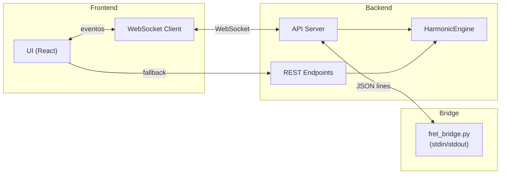

# SPEC-3.03 — API de Integração (WebSocket / REST)

> **Status:** ✅ APPROVED
> **Épico:** 3 — Renderização Gráfica e UI
> **Autor:** Lans-Anls
> **Criado em:** 2026-06-26
> **Última atualização:** 2026-06-26

---

## 1. Resumo

Define a camada de comunicação entre o frontend (grafo + UI), o backend e o adaptador `fret-bridge.py`. Especifica os protocolos WebSocket (tempo real) e REST (fallback/diagnóstico), contratos de payload e tratamento de erros.

## 2. Motivação

A plataforma possui três camadas que precisam se comunicar com baixa latência: o frontend web renderiza o grafo e o fretboard, o motor harmônico processa lógica de domínio, e o `fret-bridge.py` calcula geometrias de posição via processo Python headless. A API padroniza esta comunicação garantindo consistência e resiliência.

## 3. Definições e Glossário

| Termo | Definição |
|-------|-----------|
| **WebSocket** | Protocolo de comunicação bidirecional persistente (baixa latência) |
| **Headless Mode** | Execução do `fret.py` sem interface gráfica, comunicando via stdin/stdout JSON |
| **Fallback REST** | Endpoints HTTP síncronos usados quando WebSocket não está disponível |
| **Payload** | Corpo do dado trafegado em um evento ou requisição |

## 4. Requisitos Funcionais

### Eventos WebSocket (Tempo Real)

#### Outbound: `CHORD_SELECTED` (Grafo → fret-bridge)

Disparado quando o usuário clica em um nó do grafo.

```json
{
  "event": "CHORD_SELECTED",
  "timestamp": 1782411500000,
  "data": {
    "chordId": "E_MAJ_I",
    "name": "E Major",
    "degree": "I",
    "quality": "major",
    "intervals": [0, 4, 7],
    "voicing": {
      "rootNote": "E",
      "tones": ["E", "G#", "B"]
    },
    "constraints": {
      "maxFretSpan": 5,
      "allowOpenStrings": true
    }
  }
}
```

#### Inbound: `FRETBOARD_POSITIONS_READY` (fret-bridge → Frontend)

Resposta com as posições mapeadas no braço.

```json
{
  "event": "FRETBOARD_POSITIONS_READY",
  "timestamp": 1782411500120,
  "data": {
    "chordId": "E_MAJ_I",
    "instrument": "guitar",
    "tuning": ["E", "A", "D", "G", "B", "E"],
    "totalFound": 3,
    "positions": [
      {
        "positionId": "pos_e_maj_open",
        "baseFret": 0,
        "highestFret": 2,
        "complexityIndex": 1,
        "strings": [
          { "stringNumber": 6, "fret": 0, "isMuted": false, "note": "E" },
          { "stringNumber": 5, "fret": 2, "isMuted": false, "note": "B" },
          { "stringNumber": 4, "fret": 2, "isMuted": false, "note": "E" },
          { "stringNumber": 3, "fret": 1, "isMuted": false, "note": "G#" },
          { "stringNumber": 2, "fret": 0, "isMuted": false, "note": "B" },
          { "stringNumber": 1, "fret": 0, "isMuted": false, "note": "E" }
        ]
      }
    ]
  }
}
```

#### Inbound: `USER_FRET_INPUT_CHANGED` (Fretboard → Motor Harmônico)

Disparado no modo prática quando o usuário seleciona notas no braço.

```json
{
  "event": "USER_FRET_INPUT_CHANGED",
  "timestamp": 1782411512400,
  "data": {
    "instrument": "guitar",
    "activeFrets": [
      { "stringNumber": 6, "fret": 0 },
      { "stringNumber": 5, "fret": 2 },
      { "stringNumber": 4, "fret": 2 },
      { "stringNumber": 3, "fret": 1 },
      { "stringNumber": 2, "fret": 0 },
      { "stringNumber": 1, "fret": 0 }
    ]
  }
}
```

### Comando fret-bridge (stdin/stdout)

Comunicação com `fret_bridge.py` via processo filho (JSON por linha):

#### Request: `RESOLVE_CHORD_GEOMETRY`

```json
{
  "command": "RESOLVE_CHORD_GEOMETRY",
  "payload": {
    "tuning": ["E", "A", "D", "G", "B", "E"],
    "root": "E",
    "intervals": [0, 4, 7],
    "frets": 15
  }
}
```

#### Response (sucesso):

```json
{
  "status": "success",
  "data": {
    "tuning": ["E", "A", "D", "G", "B", "E"],
    "mapped_notes": [
      { "string_index": 0, "fret": 0, "note_name": "E", "interval_label": "0", "is_root": true },
      { "string_index": 1, "fret": 2, "note_name": "B", "interval_label": "7", "is_root": false }
    ]
  }
}
```

#### Comando: `PING` (Health Check)

```json
{ "command": "PING" }
→ { "status": "pong" }
```

### Endpoints REST (Fallback / Diagnóstico)

| Método | Endpoint | Descrição | Resposta |
|--------|----------|-----------|----------|
| `GET` | `/api/v1/instruments` | Lista instrumentos disponíveis com afinações | `200 OK` com array de presets |
| `POST` | `/api/v1/harmonies/validate-chord` | Valida um conjunto de notas como acorde | `200 OK` com `ChordValidationResult` ou `422` |
| `GET` | `/api/v1/harmonies/field/:root/:scale` | Retorna campo harmônico | `200 OK` com `HarmonicField` |
| `GET` | `/api/v1/health` | Status do sistema + bridge | `200 OK` com uptime e status do bridge |

### Tratamento de Erros

| Código | Cenário | Payload |
|--------|---------|---------|
| `400` | Parâmetros inválidos | `{ "error": "INVALID_PARAMS", "message": "..." }` |
| `422` | Notas não formam acorde válido | `{ "error": "INVALID_CHORD", "message": "..." }` |
| `500` | Erro interno do bridge | `{ "error": "BRIDGE_ERROR", "message": "..." }` |
| `503` | Bridge não disponível | `{ "error": "BRIDGE_UNAVAILABLE", "message": "..." }` |

## 5. Requisitos Não-Funcionais

- **Latência:** Round-trip WebSocket < 300ms (RNF-01).
- **Resiliência:** Fallback REST automático se WebSocket desconectar.
- **Formato:** Todos os payloads em JSON UTF-8.
- **Versionamento:** API versionada via path (`/api/v1/`).
- **Simultaneidade:** Suportar até 10 sessões concorrentes (RNF-01).

## 6. Interface / Contrato

```typescript
/**
 * Cliente da API de Integração
 */
interface IHarmonyApiClient {
  /** Conecta ao WebSocket */
  connect(): Promise<void>;

  /** Envia acorde selecionado para o bridge */
  sendChordSelected(chord: Chord, constraints?: { maxFretSpan: number }): void;

  /** Escuta posições retornadas pelo bridge */
  onPositionsReady(callback: (data: FretBridgeResponse) => void): void;

  /** Envia input do fretboard para validação */
  sendFretInput(input: FretInput): void;

  /** Escuta resultado de validação */
  onValidationResult(callback: (result: ChordValidationResult) => void): void;

  /** Health check */
  ping(): Promise<{ status: "pong" }>;

  /** Desconecta */
  disconnect(): void;
}
```

## 7. Critérios de Aceite

- [ ] CA-01: `CHORD_SELECTED` retorna `FRETBOARD_POSITIONS_READY` em < 300ms.
- [ ] CA-02: `PING` retorna `pong` confirmando que o bridge está operacional.
- [ ] CA-03: Bridge `fret_bridge.py` processa `RESOLVE_CHORD_GEOMETRY` via stdin/stdout.
- [ ] CA-04: Erro no bridge retorna JSON com `status: "error"` e mensagem descritiva.
- [ ] CA-05: REST fallback funciona quando WebSocket não está disponível.
- [ ] CA-06: `POST /api/v1/harmonies/validate-chord` retorna 422 para notas inválidas.
- [ ] CA-07: `GET /api/v1/harmonies/field/E/major` retorna campo harmônico completo.
- [ ] CA-08: Todos os endpoints versionados sob `/api/v1/`.
- [ ] CA-09: Sistema suporta 10 sessões simultâneas sem degradação.

## 8. Dependências

| Spec | Relação |
|------|---------|
| SPEC-1.02 | Fornece dados para `/api/v1/harmonies/field` |
| SPEC-1.03 | Fornece lógica para `/api/v1/harmonies/validate-chord` |
| SPEC-2.02 | Estado global emite/consome eventos WebSocket |
| SPEC-3.02 | Fretboard consome `FRETBOARD_POSITIONS_READY` |

## 9. Diagramas



## 10. Histórico de Revisões

| Versão | Data | Autor | Descrição da Mudança |
|--------|------|-------|---------------------|
| 1.0 | 2026-06-26 | Lans-Anls | Consolidação de RNF-04, Seções 10, 10.1, 10.2, 12 |
